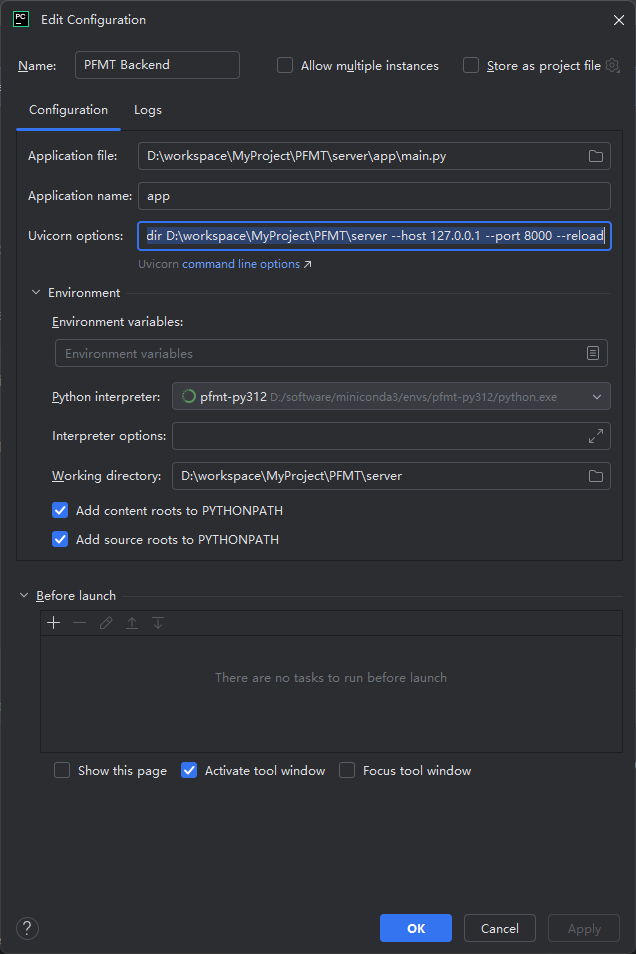

# PFMT

`PFMT` 的当前定位是一个面向单用户场景的私密文件管理系统，目标是在低资源服务器环境下，先实现稳定的文件管理、加密存储、隐藏控制与基础预览能力，再逐步接入“基于指定文件范围”的 AI 辅助能力。

## 项目定位

项目全称可理解为：

- `PFMT = Private File Management Tool`
- 当前产品方向更接近“个人私密知识库 / 私密文件管理系统”

核心目标：

- 管理文档、图片、视频、音频、PDF 等多类型文件
- 支持普通路径与私密路径区分
- 支持文件本体加密存储
- 支持隐藏目录、隐藏文件
- 支持基于文件元数据、标签、摘要的可搜索管理
- 支持在用户明确指定范围内调用 AI 对文件内容进行处理

项目边界：

- 不做全局 AI 自动检索
- AI 不主动扫描全库
- AI 只在用户指定文件、指定段落、或当前打开文档上下文下工作

## 当前产品方案摘要

### 文件与隐私保护

- 文件本体默认按“可配置启用”的方式进行加密存储
- 加密后的文件本体文件名会随机化处理
- 原始文件名只保留在数据库元数据中
- 文件读取时采用动态解密
- 需要考虑流式加解密，避免大文件一次性加载到内存
- 支持普通路径与私密路径区分
- 支持隐藏目录与隐藏文件
- “是否展示隐藏内容”由系统配置控制

### 搜索与摘要

- 当前搜索范围只覆盖元数据、标签、摘要
- 不直接对加密后的文件本体内容做全局搜索
- 摘要属于文件元数据的一部分，直接保存在文件主表中
- 摘要可由人工生成，也可由 AI 在用户触发后生成

### AI 能力边界

- AI 不提供全局检索能力
- AI 仅支持基于指定文件或指定段落完成：
  - 总结
  - 润色
  - 修改
  - 替换
  - 翻译
  - 续写
  - 扩写
- 当用户打开某个文档后，允许 AI 在该文档上下文范围内进行对话
- 类似 `@文件` 的交互，本质上也是用户明确指定读取范围

## 技术方向

当前技术方向以“轻量、可扩展、适合后续 AI 能力演进”为核心。

### 后端方向

- 语言：`Python 3.12`
- Web 框架：`FastAPI`
- 数据访问：`SQLAlchemy 2.x`
- 数据迁移：`Alembic`
- 运行方式：优先单体服务

选择原因：

- Python 对 AI 生态适配最好，后续接模型能力扩展更顺
- `FastAPI` 轻量、开发效率高、文档能力好
- `SQLAlchemy` 可以减少手写拼接 SQL 带来的注入风险
- 单体结构更适合当前 `2U2G` 资源条件

### 数据库方向

- 当前优先：`SQLite`
- 后续扩展：`PostgreSQL`

原因：

- 当前阶段以单用户、低资源、快速落地为主
- `SQLite` 足够支撑第一阶段开发与验证
- 后续如果文件量、并发量、备份任务量增长，再迁移到 `PostgreSQL`

### 前端方向

- 前端框架：`Vue 3`
- 工程方案：`Vite`
- 推荐语言：`TypeScript`

设计方向：

- 整体布局参考桌面文件管理器 + Wiki 风格导航
- 文件区域支持 `Windows Explorer` 风格的列表视图与图标视图
- 强调目录树、文件列表、文件详情、文件预览的连续操作体验

## 当前优先级功能

### 第一优先级

- 单用户简单登录
- 基础系统配置
- 文件树展示
- 文件上传
- 文件本体加密
- Markdown 文档查看
- 基础页面布局

### 第二优先级

- 文件列表展示
- 文件基础预览与打开
- 富文本编辑
- PDF 展示
- 图片查看
- 视频与音频播放
- 标签管理
- 摘要维护

### 第三优先级

- 文件内 AI 总结 / 润色 / 翻译 / 扩写
- 备份到第三方存储
- Git 备份能力
- 恢复能力
- 更完整的审计与配置管理

## 核心模块

当前项目可以按以下模块理解：

### 用户与登录

- 单用户账号
- 登录会话管理
- 基础安全控制

### 文件管理

- 目录树
- 文件列表
- 文件上传
- 文件元数据管理
- 文件标签管理
- 文件隐藏与私密路径控制

### 文件存储与加密

- 文件本体随机化命名
- 文件本体加密存储
- 流式解密读取
- 本地存储与后续对象存储扩展

### AI 文件内辅助

- 指定文件总结
- 指定段落润色、改写、翻译、续写
- 当前打开文档上下文对话

### 备份与恢复

- 备份任务记录
- 备份清单索引
- Git 目标备份
- 备份链路可选加密

### 系统配置与审计

- 隐藏功能开关
- AI 功能配置
- 备份配置
- 审计日志

## 数据设计摘要

当前数据库模型已经收敛到“文件管理模块统一前缀”的方案：

- `user_account`
- `user_session`
- `file_path`
- `file_info`
- `file_tag`
- `file_tag_rel`
- `ai_task`
- `ai_message`
- `backup_record`
- `backup_manifest`
- `audit_log`
- `system_setting`

关键原则：

- 文件业务元数据集中在 `file_info`
- 不拆单独的摘要表
- 不拆单独的文件对象表
- 路径隐藏直接放在 `file_path.is_hidden`
- 文件隐藏直接放在 `file_info.is_hidden`
- 系统级开关统一放在 `system_setting`

数据库脚本位置：

- `scripts/db/Personal_Knowledge_System_Schema.sql`

数据库访问规范：

- 统一使用 `SQLAlchemy 2.x`
- 禁止 `f-string`、`format()`、`%` 拼接 SQL
- 原生 SQL 必须参数化
- 排序字段必须白名单映射
- 多表写操作必须显式事务控制

## 推荐项目结构

当前建议的目录骨架如下：

```text
PFMT/
├─ docs/
├─ scripts/
│  └─ db/
├─ server/
│  ├─ app/
│  │  ├─ api/
│  │  ├─ core/
│  │  ├─ models/
│  │  ├─ repositories/
│  │  ├─ schemas/
│  │  ├─ services/
│  │  └─ main.py
│  └─ tests/
├─ web/
│  ├─ src/
│  │  ├─ api/
│  │  ├─ components/
│  │  ├─ layouts/
│  │  ├─ router/
│  │  ├─ stores/
│  │  └─ views/
│  └─ tests/
├─ storage/
└─ README.md
```

目录原则：

- `docs` 只放文档
- `scripts/db` 统一放 SQL
- `server` 放后端代码
- `web` 放前端代码
- `storage` 放开发环境文件本体和缓存

## 当前文档索引

项目相关文档当前集中在 `docs/`：

- `docs/Personal_Knowledge_System_PRD_Optimized.md`
- `docs/Personal_Knowledge_System_Technical_Architecture.md`
- `docs/Personal_Knowledge_System_Iteration_Plan.md`
- `docs/Personal_Knowledge_System_Frontend_UI_Spec.md`
- `docs/Personal_Knowledge_System_Database_Design.md`
- `docs/Personal_Knowledge_System_Project_Structure_Convention.md`

## 当前实现状态

截至 `2026-07-25`，第一阶段基础可用闭环已经落地，第二阶段文件管理能力和统一文档打开能力正在收口：

- 后端：`FastAPI + SQLAlchemy 2.x + SQLite`
- 前端：`Vue 3 + TypeScript + Vite + Pinia + Element Plus`
- 环境：独立 `conda` 环境 `pfmt-py312`，Python `3.12`
- 已实现：单用户登录、JWT 会话、系统配置、目录树、目录创建/改名/移动/删除、文件列表、文件属性、文件备注、文件重命名/移动/删除、文件上传、流式加密存储、隐藏内容会话态开关、标签、元数据搜索、统一文档读取/保存/转换、审计日志、请求/业务/异常日志
- 已实现前端页面：登录页、主布局、顶部导航、左侧目录树、首页、上传弹窗、系统配置页、文件列表页、文件详情页、统一文档页、属性弹窗、Markdown 兼容跳转、图片/PDF/视频基础预览
- 已补齐测试：后端 pytest、前端 Vitest、顶层阶段合同/工具校验、API 联调自检脚本
- 统一文档接口覆盖 `.txt`、`.md`、`.html`，文档转换默认生成同目录新文件，不覆盖源文件；旧 `/markdown`、`/text` 读取接口仍保留兼容。

### 本地环境

```powershell
pwsh ./scripts/dev/bootstrap_dev.ps1
```

该命令会使用 `scripts/dev/environment.yml` 创建或检查 `pfmt-py312`，并准备 `storage/db`、`storage/data`、`storage/tmp`、`storage/preview`、`storage/backup`、`storage/logs`。

### 本地启动

```powershell
pwsh ./scripts/dev/start_server.ps1
pwsh ./scripts/dev/start_web.ps1
```

默认地址：

- 后端：`http://127.0.0.1:8000`
- 前端：`http://127.0.0.1:5173`

开发默认账号：

- 用户名：`admin`
- 密码：`admin123456`

生产或长期自用前必须在本地 `.env` 中替换 `PFMT_ADMIN_PASSWORD`、`PFMT_JWT_SECRET_KEY`、`PFMT_FILE_MASTER_KEY`。其中 `PFMT_FILE_MASTER_KEY` 一旦用于加密文件，后续必须保持稳定，否则旧文件无法解密。

### 测试与自检

```powershell
pwsh ./scripts/dev/run_tests.ps1
pwsh ./scripts/dev/self_check.ps1 -RunApi
```

当前已验证：

- `conda run --no-capture-output -n pfmt-py312 python -m pytest server/tests tests`
- `conda run --no-capture-output -n pfmt-py312 python -m compileall server\app`
- `pnpm test`
- `pnpm typecheck`
- `pnpm build`
- `pwsh ./scripts/dev/run_tests.ps1 -SkipInstall`
- `pwsh ./scripts/dev/self_check.ps1 -RunApi`

### Idea启动配置
--app-dir D:\workspace\MyProject\PFMT\server --host 127.0.0.1 --port 8000 --reload


