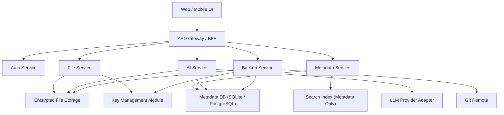

# Personal Knowledge System 技术架构文档

## 1. 文档说明

### 1.1 目的
本文档用于描述 `Personal Knowledge System` 的技术架构方案，覆盖技术选型、工具选择、系统分层、核心模块、项目结构、存储与 AI 链路、部署方案与演进建议。

### 1.2 适用范围

- 当前阶段：单用户、自托管、以个人知识沉淀为核心
- 文件类型：Markdown、富文本、PDF、图片、视频、附件
- AI 范围：仅限用户显式指定的文件、当前打开文档或指定段落

### 1.3 架构目标

1. 支持文件本体可选加密存储
2. 支持元数据搜索，不依赖全文索引
3. 支持大文件流式上传、下载、预览和解密
4. 支持可控 AI 上下文，不允许全局越权读取
5. 支持 Git 备份与恢复
6. 保持后续多用户、对象存储、RAG 的扩展空间
7. 适配 `2U2G` 低资源服务器环境
8. 优先实现最小可用闭环，再扩展富文本和多媒体能力

---

## 2. 总体架构

### 2.1 分层架构

系统建议采用以下五层：

1. 表现层：Web 前端、移动端适配、文件预览与 AI 交互
2. 应用层：业务 API、认证、文件管理、目录管理、AI 编排、备份编排
3. 领域层：文件元数据、路径模型、隐藏规则、AI 权限边界、备份模型
4. 基础设施层：数据库、对象存储、本地文件存储、缓存、消息队列、日志
5. 安全层：密钥管理、文件加密、访问审计、备份加密

### 2.2 架构图



---

## 3. 设计原则

### 3.1 安全优先

- 文件本体与元数据分离
- 存储对象名随机化
- 文件本体可选加密存储
- 备份包可选二次加密

### 3.2 最小暴露

- 搜索只基于元数据
- AI 只读取用户明确授权的范围
- 当前打开文档上下文可用，但不得跨文档扩展

### 3.3 流式处理优先

- 上传走流式加密
- 下载走流式解密
- 视频与大文件支持分段读取

### 3.4 可恢复优先

- 备份必须包含对象映射清单
- 备份必须可脱离主数据库恢复
- 关键元数据不可只存在于内存或临时缓存

### 3.5 逐步演进

- V1 不引入复杂全文检索和 RAG
- 先完成单机可用、自托管可恢复
- 先保证登录、文件树、上传、加密、展示闭环
- 后续再扩展对象存储、多用户、RAG

---

## 4. 技术选型

### 4.1 前端技术栈

| 类别 | 选型 | 原因 |
| --- | --- | --- |
| 前端框架 | `Vue 3` | 生态成熟，适合中后台与文档类产品 |
| 语言 | `TypeScript` | 有利于复杂状态、接口约束和长期维护 |
| 构建工具 | `Vite` | 启动快，构建轻，适合 Vue 3 |
| 路由 | `Vue Router` | Vue 官方方案，稳定 |
| 状态管理 | `Pinia` | 简洁、类型友好，适合中型项目 |
| UI 组件 | `Element Plus` | 桌面端后台能力成熟 |
| 移动端组件 | `Vant` | 适配移动端交互成本较低 |
| Markdown 编辑器 | `Vditor` | Markdown 体验完整 |
| 富文本编辑器 | `Tiptap` | 可扩展性强，适合自定义工具栏与文档能力 |
| PDF 预览 | `PDF.js` | 前端预览能力成熟 |
| 请求库 | `Axios` 或 `fetch` 封装 | 易于做统一鉴权和错误处理 |

### 4.2 后端技术栈

| 类别 | 选型 | 原因 |
| --- | --- | --- |
| 运行时 | `Python 3.12` | AI 生态最强，后续扩展模型、OCR、转写、RAG 更灵活 |
| 后端框架 | `FastAPI` | 轻量、异步友好、资源占用低，适合 `2U2G` 环境 |
| 语言 | `Python` | 对 AI 功能扩展最友好，后续接入模型和推理工具成本更低 |
| ORM | `SQLAlchemy 2.x + Alembic` | 生态成熟，足够灵活，适合轻量后端架构 |
| API 规范 | `RESTful API` | 当前阶段实现成本低，便于前后端协作 |
| 数据校验 | `Pydantic v2` | FastAPI 原生集成，定义接口和配置非常方便 |
| 认证 | 简单登录 + JWT | 满足单用户阶段，足够轻量 |

### 4.3 数据与存储

| 类别 | 选型 | 原因 |
| --- | --- | --- |
| 主数据库 | `SQLite` 优先，兼容 `PostgreSQL` 升级 | V1 单用户、低资源环境更轻，后续可平滑升级 |
| 缓存 | V1 不引入，必要时再加 `Redis` | 减少常驻进程数量，降低内存压力 |
| 文件存储 | 本地磁盘优先，兼容 `MinIO / S3` 接口 | V1 本地部署简单，后续可平滑扩展对象存储 |
| 搜索索引 | SQLite / PostgreSQL 元数据索引 | 当前只做元数据搜索，没必要先上 ES |
| 备份目标 | `Git` | 满足当前版本化备份目标 |

### 4.4 AI 与模型接入

| 类别 | 选型 | 原因 |
| --- | --- | --- |
| AI 编排 | 自建 `AI Service` | 统一处理权限边界、上下文裁剪、模型路由 |
| 模型协议 | OpenAI Compatible API | 兼容 OpenAI、DeepSeek、通义千问等供应商 |
| 本地模型 | `Ollama` | 自托管友好 |
| Prompt 管理 | 后端模板化配置 | 便于控制当前文档问答、段落润色等任务 |

### 4.5 加密与安全

| 类别 | 选型 | 原因 |
| --- | --- | --- |
| 文件加密算法 | `AES-256-GCM` | 常见、成熟，支持完整性校验 |
| 密钥派生 | `HKDF` 或等价 KDF | 基于主密钥和 `file_id` 派生文件密钥 |
| 哈希校验 | `SHA-256` | 适合文件校验与恢复校验 |
| 密码哈希 | `Argon2id` | 登录密码存储安全性更高 |

---

## 5. 工具选择

### 5.1 开发工具

| 类别 | 工具 | 用途 |
| --- | --- | --- |
| 前端包管理 | `pnpm` | 节省依赖空间，适合前端工作区 |
| Python 包管理 | `uv` | 安装快、环境轻，适合 Python 项目 |
| 前端规范 | `ESLint` | 统一前端代码质量规则 |
| Python 规范 | `ruff` | 轻量高效，可覆盖 lint 与部分格式化场景 |
| Python 格式化 | `black` | 统一 Python 格式 |
| 前端格式化 | `Prettier` | 统一前端格式 |
| 提交校验 | `Husky + lint-staged` | 降低脏提交概率 |
| 接口调试 | `Apifox` 或 `Postman` | API 调试与文档联调 |
| 数据库管理 | `DB Browser for SQLite` / `TablePlus` | 快速查看元数据 |
| 日志查看 | `rich` / 标准日志封装 | 本地开发日志更可读 |

### 5.2 测试工具

| 类别 | 工具 | 用途 |
| --- | --- | --- |
| 前端单元测试 | `Vitest` | Vue 生态适配较好 |
| 后端测试 | `pytest` | Python 生态成熟，适合单元与集成测试 |
| 端到端测试 | `Playwright` | 覆盖上传、搜索、AI、备份主流程 |
| API 测试 | `httpx` + `pytest` | FastAPI 测试链路轻便 |

### 5.3 运维工具

| 类别 | 工具 | 用途 |
| --- | --- | --- |
| 容器化 | `Docker` 可选 | 开发和发布方便，但不是 V1 必需 |
| 编排 | `Docker Compose` 可选 | 可用于部署，也可直接使用 `systemd` 运行 |
| 反向代理 | `Nginx` 或 `Caddy` | HTTPS、静态资源、反向代理 |
| 监控 | V1 仅保留基础日志与健康检查 | 避免低配机器额外开销 |

---

## 6. 核心模块设计

### 6.1 认证与会话模块

职责：

- 用户登录
- JWT 签发与刷新
- 登录态校验
- 单用户管理员模式控制

关键点：

- 密码使用 `Argon2id` 存储
- 单用户阶段优先支持简单登录
- 使用轻量 JWT 会话机制

### 6.2 路径与目录模块

职责：

- 普通路径 / 私密路径管理
- 树状目录维护
- 隐藏路径与隐藏文件规则管理

关键点：

- 路径分类不直接等于加密分类
- 父路径隐藏时对子节点产生默认影响

### 6.3 文件存储模块

职责：

- 文件上传
- 文件流式加密
- 文件对象名随机化
- 文件流式下载与解密
- 图片 / 视频 / PDF 预览支持

关键点：

- 不以原始文件名做存储对象名
- 不一次性加载整文件到内存

### 6.4 元数据模块

职责：

- 文件名、路径、类型、标签、摘要、大小等管理
- 搜索索引构建
- 文件映射清单数据维护

关键点：

- 元数据可搜索
- 元数据不等于文件本体

### 6.5 AI 模块

职责：

- 指定文件总结
- 当前打开文档问答
- 指定段落润色 / 替换 / 翻译 / 续写
- `@文件` 显式引用解析

关键点：

- 不允许全局主动检索知识库
- 必须显示本次 AI 可读取范围
- 当前打开文档允许上下文问答，但不可越权读取其他文件

### 6.6 备份与恢复模块

职责：

- 备份包生成
- Git 推送
- 备份级加密
- 恢复预览与恢复执行

关键点：

- 备份包必须包含对象映射清单
- 必须支持数据库丢失后的重建恢复

### 6.7 审计与日志模块

职责：

- 文件访问日志
- 隐藏内容展示日志
- AI 调用日志
- 备份与恢复日志

关键点：

- 对敏感操作要能追溯
- 后续可用于安全审计

---

## 7. 数据流与核心链路

### 7.1 文件上传链路

```text
前端上传文件
-> 后端生成 file_id
-> 计算存储对象名
-> 基于 file_id 派生文件密钥
-> 流式加密文件本体
-> 写入文件存储
-> 写入元数据与映射关系
-> 返回上传结果
```

### 7.2 文件读取链路

```text
用户请求读取文件
-> 校验登录态与隐藏规则
-> 查询元数据与对象映射
-> 获取文件密钥
-> 从存储层流式读取密文
-> 流式解密
-> 返回文件流或预览流
```

### 7.3 AI 调用链路

```text
用户选择文件 / 打开文档 / 选中段落 / @文件
-> 前端提交 AI 请求与上下文边界
-> 后端校验本次可读取范围
-> 读取必要文件内容或文档片段
-> 裁剪上下文
-> 调用模型适配器
-> 返回 AI 结果
-> 写入 AI 操作日志
```

### 7.4 备份链路

```text
用户触发备份
-> 导出元数据
-> 读取文件对象映射
-> 组装备份包
-> 可选执行备份级加密
-> 提交到 Git 仓库
-> 写入备份日志
```

### 7.5 恢复链路

```text
用户选择备份版本
-> 解包备份文件
-> 校验映射清单和密钥封装信息
-> 恢复元数据
-> 恢复文件密文对象
-> 重建目录、标签、摘要、隐藏规则
-> 输出恢复结果
```

---

## 8. MVP 实施优先级

### 8.1 第一优先级

必须优先实现以下能力：

1. 单用户简单登录
2. 文件树与路径管理
3. 文件上传
4. 文件本体加密存储
5. 文件列表与基础展示
6. 元数据搜索

### 8.2 第二优先级

在第一阶段稳定后，再实现：

1. 当前打开文档 AI 问答
2. 指定文件总结
3. 指定段落润色 / 修改 / 翻译 / 续写
4. `@文件` 引用

### 8.3 第三优先级

后续再补齐：

1. 富文本编辑
2. 视频预览与流式播放优化
3. PDF 在线展示
4. 备份加密与恢复增强
5. 更完善的操作审计

### 8.4 V1 不建议直接做的内容

- 多用户
- Redis
- Elasticsearch
- 全文检索
- RAG
- 复杂工作流编排
- 重型监控组件

---

## 9. 项目结构建议

### 9.1 推荐仓库结构

```text
PFMT/
├─ docs/
│  ├─ Personal_Knowledge_System_PRD_Optimized.md
│  └─ Personal_Knowledge_System_Technical_Architecture.md
├─ web/
│  ├─ src/
│  │  ├─ app/
│  │  ├─ pages/
│  │  ├─ components/
│  │  ├─ modules/
│  │  ├─ stores/
│  │  ├─ router/
│  │  ├─ api/
│  │  └─ utils/
│  ├─ public/
│  └─ package.json
├─ server/
│  ├─ app/
│  │  ├─ main.py
│  │  ├─ api/
│  │  ├─ modules/
│  │  │  ├─ auth/
│  │  │  ├─ files/
│  │  │  ├─ metadata/
│  │  │  ├─ paths/
│  │  │  ├─ ai/
│  │  │  ├─ backup/
│  │  │  ├─ audit/
│  │  │  └─ system/
│  │  ├─ core/
│  │  ├─ infra/
│  │  └─ schemas/
│  ├─ migrations/
│  ├─ tests/
│  ├─ pyproject.toml
│  └─ uv.lock
├─ storage/
│  ├─ objects/
│  ├─ temp/
│  └─ backups/
├─ scripts/
│  ├─ backup/
│  ├─ restore/
│  └─ ops/
├─ deploy/
│  ├─ nginx/
│  ├─ systemd/
│  └─ docker/
├─ .env.example
└─ README.md
```

### 9.2 前端模块建议

- `modules/files`：文件列表、上传、预览
- `modules/paths`：目录树、路径管理、隐藏规则
- `modules/editor`：Markdown / 富文本编辑
- `modules/ai`：AI 对话面板、选区处理、`@文件` 引用
- `modules/settings`：系统配置、备份配置、加密配置

### 9.3 后端模块建议

- `auth`：登录、Token、会话
- `files`：文件上传下载、流式加解密
- `metadata`：元数据和标签管理
- `paths`：目录树、普通路径、私密路径、隐藏规则
- `ai`：AI 权限边界、上下文裁剪、模型调用
- `backup`：备份包、Git 推送、恢复
- `audit`：审计日志
- `system`：系统配置、健康检查

---

## 10. 数据库设计建议

### 9.1 核心表

建议至少包含以下表：

- `users`
- `paths`
- `files`
- `file_objects`
- `file_tags`
- `tags`
- `file_summaries`
- `hidden_rules`
- `ai_tasks`
- `audit_logs`
- `backups`

### 9.2 关键字段建议

`files` 表建议包含：

- `id`
- `file_id`
- `path_id`
- `original_name`
- `mime_type`
- `size`
- `summary`
- `is_hidden`
- `visibility_type`
- `created_at`
- `updated_at`

`file_objects` 表建议包含：

- `id`
- `file_id`
- `storage_object_name`
- `storage_provider`
- `encryption_enabled`
- `checksum_sha256`
- `key_wrap_version`

`backups` 表建议包含：

- `id`
- `backup_name`
- `backup_type`
- `git_commit_id`
- `encrypted`
- `status`
- `created_at`

---

## 11. AI 技术方案

### 10.1 AI 能力边界

当前阶段只支持：

- 基于指定文件总结
- 基于当前打开文档问答
- 基于选中段落润色、修改、翻译、续写
- 基于 `@文件` 的多文件受控分析

不支持：

- AI 全局检索知识库
- 自动读取未授权文件
- 后台静默扫描文件内容建立全文知识索引

### 10.2 AI Service 结构

建议拆成：

- `context-resolver`：解析当前文档、选中段落、`@文件`
- `permission-guard`：校验本次 AI 可读取范围
- `prompt-builder`：按任务构造 Prompt
- `model-adapter`：统一对接 OpenAI Compatible API
- `result-handler`：处理 AI 输出与日志记录

### 10.3 Prompt 模板分类

- 文档总结模板
- 当前文档问答模板
- 段落润色模板
- 段落替换模板
- 段落翻译模板
- 段落续写模板

---

## 12. 文件加密设计建议

### 11.1 密钥模型

建议方案：

1. 系统持有 `master_key`
2. 每个文件拥有稳定 `file_id`
3. 通过 `file_id + master_key` 派生 `file_key`
4. `file_key` 用于文件本体加密

### 11.2 为什么不用文件名做密钥输入

- 文件名会变
- 文件名可能重复
- 文件名可猜测
- 文件名不适合作为安全锚点

### 11.3 加密方式

- 算法：`AES-256-GCM`
- 加密模式：分块流式处理
- 校验：每个文件保留 `SHA-256`

### 11.4 临时文件策略

- 尽量不落明文临时文件
- 必须落盘时放入 `temp` 目录
- 临时文件设置短时过期
- 使用后立即清理

---

## 13. 备份设计建议

### 12.1 备份包内容

- 文件密文对象
- 文件元数据导出
- 路径结构导出
- 标签导出
- 隐藏规则导出
- 对象映射清单
- 密钥封装信息
- 备份 manifest

### 12.2 备份包结构建议

```text
backup-2026-07-23/
├─ manifest.json
├─ metadata/
│  ├─ files.json
│  ├─ paths.json
│  ├─ tags.json
│  └─ hidden_rules.json
├─ mappings/
│  └─ object_mapping.json
├─ keywrap/
│  └─ key_manifest.json
└─ objects/
   ├─ 8f/
   ├─ a1/
   └─ ...
```

### 12.3 Git 备份策略

- 本地生成备份包
- 可选执行备份级加密
- 提交到备份仓库
- 使用时间戳或版本号做提交说明

---

## 14. 部署方案

### 14.1 V1 推荐部署

- 单机部署
- 本地磁盘文件存储
- `SQLite`
- `FastAPI + Uvicorn`
- `Nginx` 或 `Caddy`

### 14.2 服务拆分

V1 可先单体部署：

- `web`
- `server`

V2 后再考虑拆分：

- AI Service 独立
- Backup Service 独立
- 对象存储外置

### 14.3 环境区分

- `dev`：本地开发
- `staging`：预发布验证
- `prod`：生产环境

### 14.4 低资源服务器部署建议

针对 `2U2G` 环境，建议：

- V1 不引入 Redis
- V1 不引入 PostgreSQL，优先 SQLite
- AI 调用全部走外部模型接口，不本地部署大模型
- 视频预览优先做基础文件流展示，不做重转码
- 只保留必要后台进程

---

## 15. 非功能要求

### 14.1 性能要求

- 小文件上传和下载响应稳定
- 大文件走流式链路
- 搜索以元数据为主，避免重索引压力

### 14.2 安全要求

- 全链路 HTTPS
- JWT 有效期控制
- 敏感操作审计
- 文件密钥不明文持久化在普通日志中

### 15.3 可维护性要求

- 前端 TypeScript + 后端 Python 分层清晰
- 模块边界清晰
- 配置集中管理
- 关键链路可观测

---

## 16. 演进路线建议

### 16.1 V1

- 单用户
- 本地存储
- SQLite
- 文件本体可选加密
- 元数据搜索
- 当前文档与指定文件 AI
- Git 备份

### 16.2 V2

- MinIO / S3 对象存储
- 更完善的预览能力
- AI 模型管理后台
- 自动摘要工作流

### 16.3 V3

- 多用户
- 更细粒度权限
- 可选 OCR / 转写
- 可控 RAG 扩展

---

## 17. 最终建议

当前项目最适合采用：

- `Vue 3 + TypeScript + Vite + Element Plus + Pinia`
- `FastAPI + Python 3.12 + SQLAlchemy + SQLite`
- 本地磁盘存储起步，后续兼容 `MinIO / S3`
- 文件本体可选加密，元数据搜索，AI 只读指定范围
- 单机轻量部署优先，`Docker Compose` 仅作为可选方式

这是一个实现成本、扩展空间、安全边界都相对平衡的方案，适合作为当前版本的正式技术架构基线。
